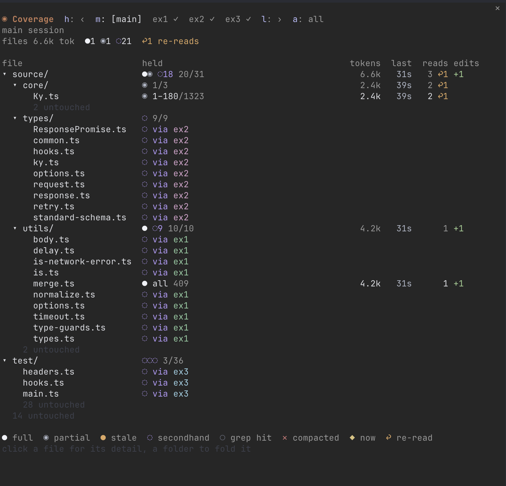
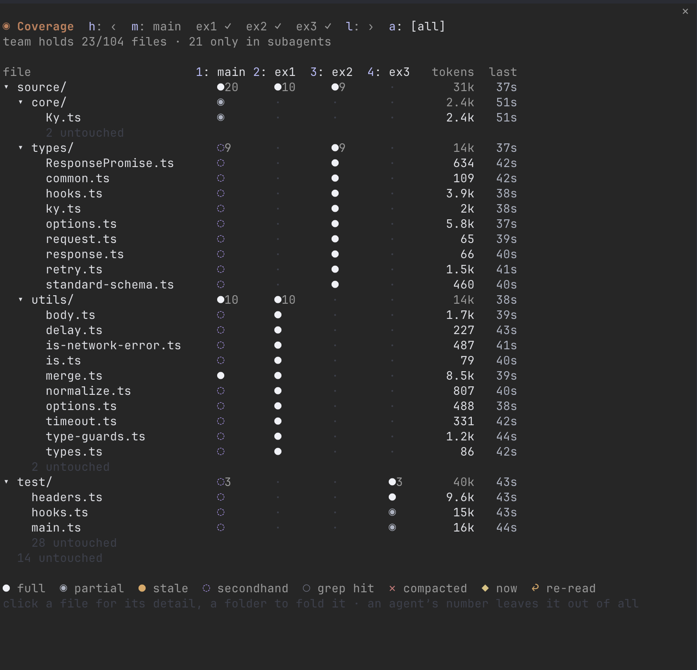

# slash-coverage

A Claude Code mod that shows which files each agent has in its context, and how much of each.

When Claude spawns subagents, the main session doesn't get the files they read. It gets their reports. slash-coverage keeps that visible: for the main session and every subagent, which files it holds in full, which only in part (and which lines), which it knows only through a subagent, which copies went stale after an edit, and what each one costs in tokens.



## Install

In a Claude Code terminal session:

```
/plugin install slash-coverage --marketplace Davron2004/slash-coverage
```

Answer `y` to add the marketplace, then pick a scope. In a fullscreen terminal at least 144 columns wide the pane opens on the right when a session starts; in a narrower one, `/coverage` opens it. `/coverage` also hides it. Ctrl+X then Tab gives the pane the keyboard, so its keys below work.

slash-coverage is built on Claude Code's mod API (function hooks), which is early access and changes between versions. It was built against Claude Code 2.1.292.

## Reading it

Pick an agent in the row at the top, and every column describes that agent:

| Column | Shows |
| --- | --- |
| **held** | What's in its context: `● all`, the line ranges it read (`◉ 1–180/1323`), `● stale ✎main` when another agent edited the file after it read it, `◌ via ex1` when only a subagent it spawned read it, `○ grep hit`, or `✕ compacted` |
| **tokens** | What the file's tool results cost its context |
| **last** | Time since it last read, searched or edited the file |
| **reads** | Read calls, with `↩n` for reads of lines it already held |
| **edits** | Lines it added and removed |

| Glyph | Means |
| --- | --- |
| `●` | The whole file, current |
| `◉` | Some of its lines |
| `●` (orange) | Read before another agent edited it |
| `◌` | A subagent this agent spawned holds it, so this agent has only that subagent's report |
| `○` | Named in a search, listing or line count, never opened |
| `✕` | Read, then dropped by compaction |
| `◆` | The file an agent is working on right now |

Rows are every file any agent touched, so switching agents changes the cells but never moves the rows. Untouched files fold into one "N untouched" line per folder. A folder's row sums what's inside it, strongest first: short runs as glyphs, longer ones counted, `●● ◉ ◌14 ○○○ 20/31`. Click a file for what every agent knows of it, and a folder to fold it.

| Key | Does |
| --- | --- |
| `h` / `l` | Step to the previous or next agent, in the order they were spawned. The row scrolls; `‹ 3` and `5 ›` count the agents off screen |
| `m` | Main session |
| `a` | All agents side by side |

## All agents side by side



`a` puts one narrow column per agent next to the file tree, then the team's tokens and last touch. It shows what no single agent's view can: two subagents paying for the same file, and folders no agent covered.

Each agent's header is a numbered toggle. Press its number (`2` for `2: ex1`) to leave that agent out of the view, as if it never ran. Its column stays, dimmed as `⊘ex1`, and the same number brings it back. So you can see what your backend agents know without the UI agent's reads mixed in.

## How it works

Every value comes from tool calls Claude Code already makes, and nothing asks an agent to report anything:

- **Read** results give the exact line ranges and the file's length.
- **Edit** and **Write** patches give lines added and removed. They also shift the editor's own line ranges, and they mark every other agent's copy of the file stale.
- **Grep** and **Glob** results, and shell commands that search or count (`grep`, `rg`, `wc`), give search hits. A path only counts when it starts a line of the output, so a file merely mentioned inside another file's content doesn't.
- **Shell reads** (`cat`, `sed`, `head`) are parsed, with `cd`s followed and globs expanded. Their exact lines are unknown, so they show as partial. `git status` after each command catches files a command changed.
- **Spawns** give each subagent's parent, and a subagent counts as done when its turn ends.
- **Secondhand** (`◌`) is structural: a subagent you spawned read the file. Nothing judges what its report said.

## It survives a restart

slash-coverage keeps a log per agent of what it read, searched and edited, and saves it in the chat's own folder next to the transcript: `~/.claude/projects/<project>/<chat id>/slash-coverage/main.json`, plus one file per subagent. Resuming the chat (`--resume`, `--continue`) replays the logs in time order and the grid comes back as it was, stale copies included. Claude Code deletes a chat's folder along with its transcript, so the logs go with it. `/coverage clear` empties them.

## Limits

- Files Claude Code loads on its own, like `CLAUDE.md`, never pass through a tool call, so they don't show.
- Token counts are estimates (characters ÷ 4).
- A shell read's lines are unknown, so it never counts as a full read.
- A forked chat starts empty: the fork gets a new folder, and the logs aren't copied into it.
- Only the terminal has been checked visually. The desktop app draws the same elements, untested.
- The glyphs are chosen to sit in one cell of JetBrains Mono (Ghostty's default font). A font that lacks them can draw them wider.

## Develop

```sh
git clone https://github.com/Davron2004/slash-coverage
claude --plugin-dir ./slash-coverage   # run a session with it; saving a file reloads it
cd slash-coverage
claude plugin validate .
claude plugin test .
tsc -p .                               # after the first load, which lays the API's types in .claude-plugin/types
```

`hooks/knowledge.ts` turns tool events into levels, `hooks/events.ts` holds the event log and its replay, `hooks/paths.ts` reads shell commands and their output, and `hooks/register.tsx` wires them to Claude Code and draws the pane.

## License

MIT
